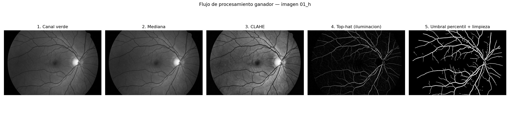
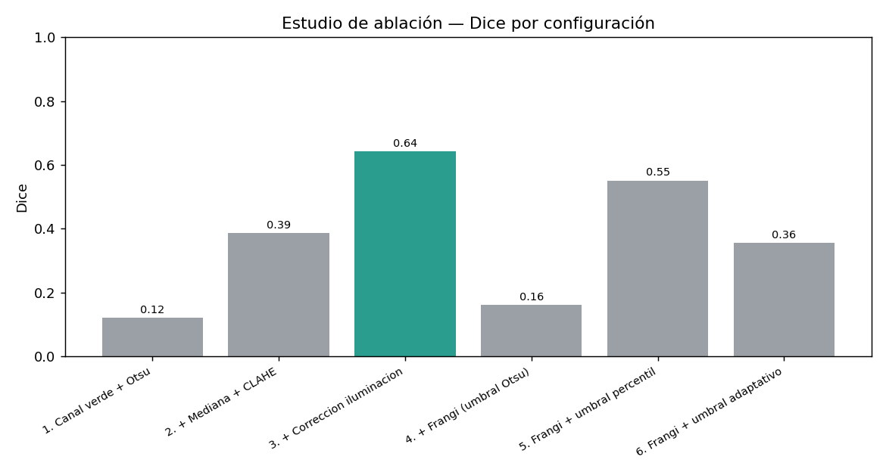
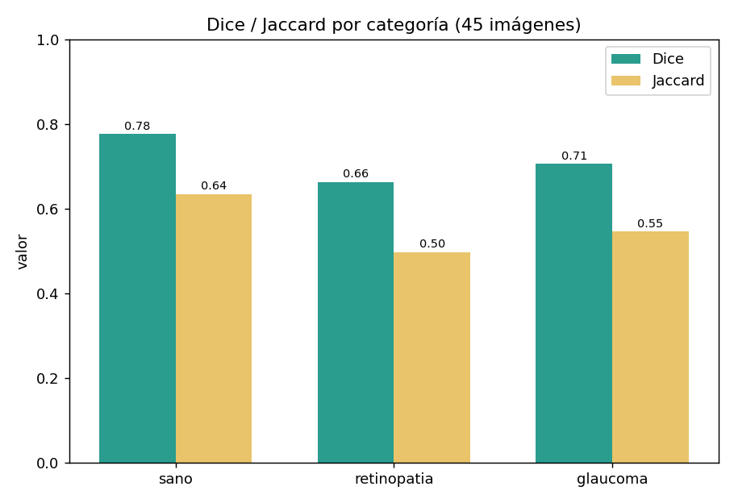
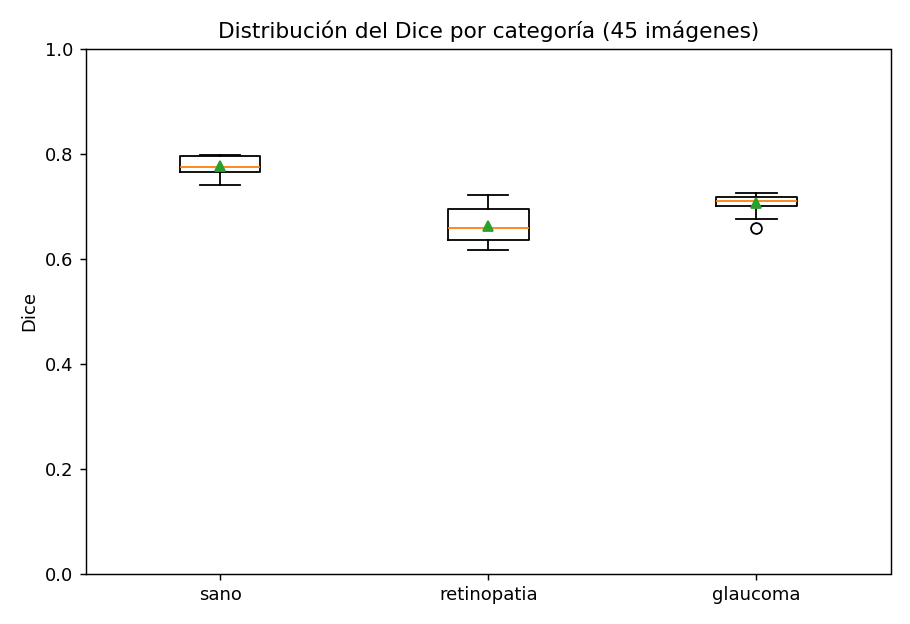
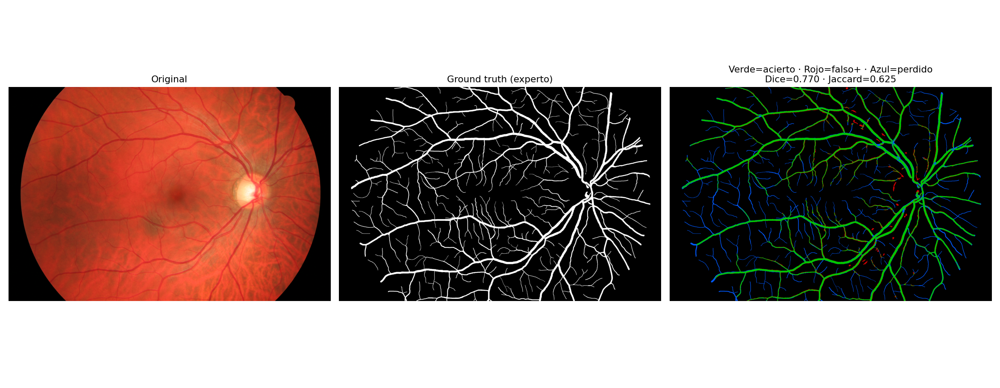

# Metodología y Resultados

**Trabajo parcial — Segmentación de vasos sanguíneos en imágenes de fondo de ojo (HRF)**
**Grupo 3 (Sección B)** · Método: **técnicas determinísticas (sin machine learning)**
**Métricas de selección:** coeficiente de **Dice** e **índice de Jaccard (IoU)**

---

## 1. Objetivo y enfoque

Segmentar los vasos sanguíneos del dataset **HRF** (45 imágenes: 15 sanas, 15 con
retinopatía diabética, 15 con glaucoma) usando **solo técnicas clásicas de
procesamiento de imágenes**, y elegir la mejor solución por **Dice/Jaccard**.

La metodología fue **experimental y guiada por datos**: se partió de un flujo mínimo
y se fue **agregando/variando una técnica a la vez** (estudio de ablación + refinamiento),
midiendo Dice y Jaccard en cada paso para **justificar cada decisión con evidencia**.

## 2. Flujo de procesamiento propuesto (ganador)

| # | Etapa | Técnica | Por qué |
|---|---|---|---|
| 1 | Selección de canal | **Canal verde** | Es donde los vasos contrastan más (el rojo se satura, el azul es ruidoso) |
| 2 | Reducción de ruido | **Filtro de mediana** (k=5) | Quita ruido preservando los bordes de los vasos |
| 3 | Realce de contraste | **CLAHE** (clip=2.0, grid=8) | Resalta vasos finos por zonas, sin quemar la imagen |
| 4 | Corrección de iluminación | **Black top-hat** (cierre morfológico, kernel elíptico 15) | Empareja la iluminación y deja los vasos **claros** sobre fondo uniforme; atenúa el disco óptico |
| 5 | Binarización | **Umbral por percentil** (P90 dentro del FOV) | Controla mejor la sensibilidad que Otsu en este realce |
| 6 | Post-proceso | **Limpieza** (quitar objetos < 60 px) + **recorte al FOV** | Elimina ruido y descarta el borde fuera de la retina |

## 3. Metodología experimental

### 3.1 Estudio de ablación (qué aporta cada técnica)

| Configuración | Dice | Jaccard |
|---|:--:|:--:|
| 1. Canal verde + Otsu | 0.121 | 0.066 |
| 2. + Mediana + CLAHE | 0.386 | 0.245 |
| 3. + Corrección de iluminación (top-hat) | **0.643** | **0.480** |
| 4. Frangi + Otsu | 0.161 | 0.090 |
| 5. Frangi + umbral percentil | 0.551 | 0.410 |
| 6. Frangi + umbral adaptativo | 0.355 | 0.232 |

**Conclusión:** la corrección de iluminación (top-hat) es la técnica de mayor aporte
(+0.26 de Dice). El **filtro de Frangi NO mejora** en este dataset (incluso lo empeora),
por lo que **se descartó** — una decisión contraintuitiva pero respaldada por los datos.

### 3.2 Refinamiento (búsqueda de parámetros)

Partiendo del flujo ganador se ajustaron el tamaño del kernel del top-hat, el tipo de
umbral y el percentil. Mejores configuraciones (subconjunto de 9 imágenes):

| Configuración | Dice | Jaccard |
|---|:--:|:--:|
| **bg_kernel=15 · percentil 90 · CLAHE 2.0** | **0.702** | **0.543** |
| bg_kernel=21 · percentil 90 | 0.700 | 0.541 |
| bg_kernel=15 · percentil 90 · min_size 30 | 0.697 | 0.538 |

**Hallazgo:** un **kernel de top-hat pequeño (15)** capta mejor los vasos finos.

## 4. Resultados finales (45 imágenes)

| Métrica | Valor |
|---|:--:|
| **Dice** | **0.716** |
| **Jaccard (IoU)** | **0.560** |
| Sensibilidad | 0.746 |
| Especificidad | 0.968 |
| Exactitud | 0.947 |

### Por categoría

| Categoría | Dice | Jaccard |
|---|:--:|:--:|
| Sano | 0.777 | 0.635 |
| Glaucoma | 0.707 | 0.547 |
| Retinopatía diabética | 0.664 | 0.498 |

La retinopatía es la más difícil (lesiones que generan confusión); los sanos son los
más altos y consistentes.

### Evolución (resumen del trabajo)

| Etapa | Dice | Sensibilidad | Tiempo (45 img) |
|---|:--:|:--:|:--:|
| Baseline (Frangi + Otsu) | 0.22 | 0.13 | 316 s |
| Ablación (top-hat + Otsu) | 0.64 | — | — |
| **Refinamiento (final)** | **0.716** | **0.746** | **16.5 s** |

Se **triplicó el Dice**, se multiplicó por ~6 la sensibilidad y el flujo final es **20×
más rápido** (al prescindir de Frangi).

## 5. Análisis visual

Comparación píxel a píxel con el *ground truth*: 🟢 verde = aciertos (TP), 🔴 rojo =
falsos positivos (FP), 🔵 azul = vasos perdidos (FN). Se observa **alta precisión**
(muy poco rojo) y buena captura de los vasos principales (mucho verde); los **vasos
más finos** son lo que aún se escapa (azul).

## 6. Fórmulas

**Métricas de evaluación**
$$\text{Dice} = \frac{2\,TP}{2\,TP + FP + FN} \qquad \text{Jaccard (IoU)} = \frac{TP}{TP + FP + FN}$$

**Black top-hat** (realce de vasos), con cierre morfológico `•` y elemento estructurante `b`:
$$BTH(f) = (f \bullet b) - f$$
Los vasos (oscuros) quedan resaltados como estructuras claras.

**Umbral por percentil:** se binariza conservando los píxeles cuyo realce supera el
**percentil 90** calculado dentro del FOV.

## 7. Conclusiones

- El **realce morfológico (black top-hat) + umbral por percentil** es la mejor solución
  determinística para HRF en este trabajo: **Dice 0.716 / Jaccard 0.560**.
- **Cada decisión está justificada con datos** (ablación y refinamiento), no por intuición.
- Se **descartó Frangi** porque la evidencia mostró que no aporta en este dataset.

## 8. Limitaciones y trabajo futuro

- Se pierden algunos **vasos muy finos** (visible en el overlay) → explorar realces
  multiescala o umbral por histéresis.
- El procesamiento se hace a media resolución (`SCALE=0.5`) por velocidad; probar
  **resolución completa** re-ajustando el tamaño del kernel del top-hat.
- Manejo específico de **lesiones** en retinopatía/glaucoma para reducir falsos positivos.
